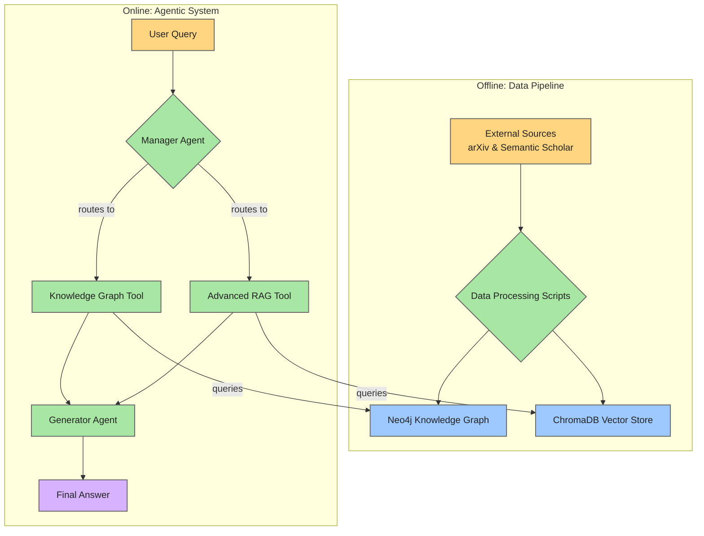

# **ScholarAgent: An Advanced Multi-Agent Research Assistant**

ScholarAgent is a sophisticated multi-agent system designed to perform deep, relational reasoning over a corpus of scientific papers. It moves beyond standard RAG by building and querying a dynamic Knowledge Graph, allowing it to answer complex questions that require synthesizing information across multiple documents and their relationships.

### **Key Features**

* **Automated Knowledge Graph Construction:** A Makefile-driven pipeline that automatically fetches papers from arXiv, enriches them with data from Semantic Scholar, extracts key concepts, and builds a comprehensive Neo4j Knowledge Graph.  
* **Intelligent Multi-Agent System:** Built with LangGraph, the system uses a Manager agent to intelligently route complex queries to specialized tools.  
* **Hybrid Toolset for Deep Reasoning:**  
  * **Advanced RAG Tool:** For content-based questions, using a retrieve-then-rerank pipeline for high-quality context.  
  * **Knowledge Graph Tool:** For relational questions, using a powerful gemini-1.5-pro model to translate natural language into precise Cypher database queries.  
* **Tiered LLM Strategy:** Utilizes the efficient gemini-1.5-flash for general tasks and the powerful gemini-1.5-pro for high-stakes reasoning, balancing performance and cost.  
* **Fully Tested and Type-Hinted:** A robust test suite built with pytest and a modern, type-hinted codebase.

### **Architecture Overview**

The system is split into two core components: an offline Data Pipeline that builds the knowledge base, and an online Agentic System that uses it to answer questions.


### **Getting Started**

These instructions will get you a copy of the project up and running on your local machine for development and testing purposes.

**Prerequisites:**

* Python 3.10+  
* Poetry (for dependency management)  
* A running Neo4j instance (e.g., via Docker)  
* A Google AI API Key

**Installation:**

1. **Clone the repository:**
   ```python
   git clone \[https://github.com/\](https://github.com/)\<your\_github\_username\>/scholar-agent.git  
   cd scholar-agent
   ```

2. Create a .env file:  
   Copy the example environment file and add your credentials.
   ```python 
   cp .env.example .env  
   \# Now, edit the .env file with your API keys and database URI
   ```

3. **Install dependencies:** 
   ```python 
   poetry install
   ```

4. Build the Knowledge Graph:  
   This command will run the entire data pipeline. This may take some time. 
   ```python 
   make all
   ```

### **Usage**

Once the knowledge graph is built, you can ask the agent questions from the command line.

**Example 1: Relational Query (Knowledge Graph Tool)**
```python 
python main.py "Who are the most cited authors on the topic of 'sparse autoencoders'?"
```
**Example 2: Content Query (RAG Tool)**
```python 
python main.py "Summarize the abstract of the paper 'Attention Is All You Need'"
```
**Example 3: Complex Hybrid Query**
```python 
python main.py "How are researchers at Anthropic using dictionary learning for interpretability, particularly in relation to sparse autoencoders?"  
```
