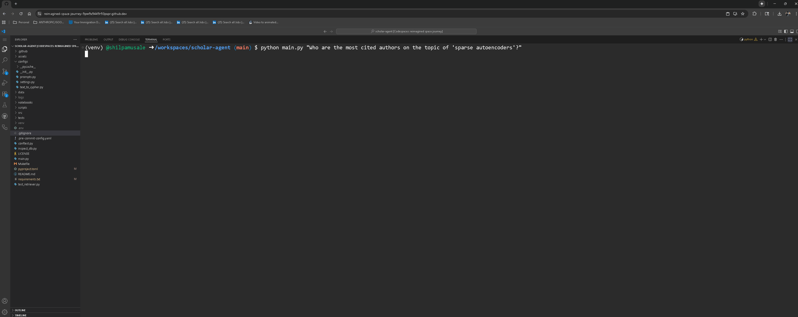
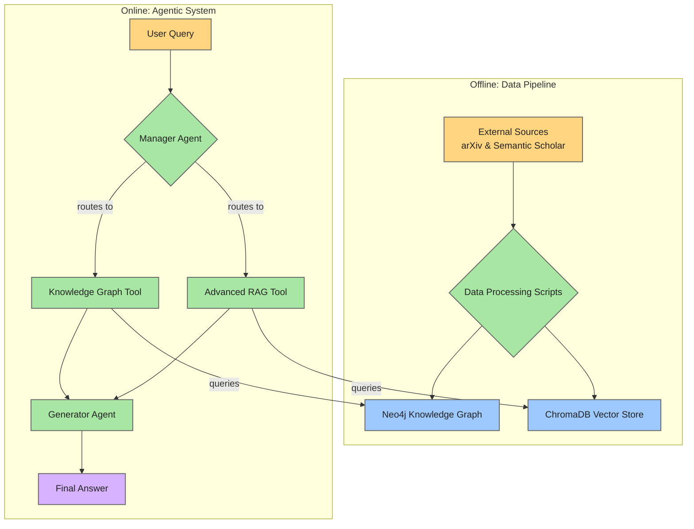

# ScholarAgent: An Advanced Multi-Agent Research Assistant

[](https://github.com/shilpamusale/scholar-agent/actions/workflows/ci.yml)
[](https://codecov.io/gh/shilpamusale/scholar-agent)
[](https://github.com/astral-sh/ruff)
[](https://github.com/psf/black)
[](https://opensource.org/licenses/Apache-2.0)
[](https://www.python.org/downloads/release/python-3120/)

ScholarAgent is a sophisticated multi-agent system designed to perform deep, relational reasoning over a corpus of scientific papers. It moves beyond standard RAG by building and querying a dynamic Knowledge Graph, allowing it to answer complex questions that require synthesizing information across multiple documents and their relationships.

---

## Demo


*(A demonstration of the agent answering a complex query using the Knowledge Graph tool.)*

---

## Key Features

* **Automated Knowledge Graph Construction:** A `Makefile`-driven pipeline that automatically fetches papers from arXiv, enriches them with data from Semantic Scholar, extracts key concepts, and builds a comprehensive Neo4j Knowledge Graph.
* **Intelligent Multi-Agent System:** Built with LangGraph, the system uses a Manager agent to intelligently route complex queries to specialized tools.
* **Hybrid Toolset for Deep Reasoning:**
    * **Advanced RAG Tool:** For content-based questions, using a retrieve-then-rerank pipeline for high-quality context.
    * **Knowledge Graph Tool:** For relational questions, using a powerful `gemini-1.5-pro` model to translate natural language into precise Cypher database queries.
* **Tiered LLM Strategy:** Utilizes the efficient `gemini-1.5-flash` for general tasks and the powerful `gemini-1.5-pro` for high-stakes reasoning, balancing performance and cost.
* **Fully Tested and Type-Hinted:** A robust test suite built with `pytest` and a modern, type-hinted codebase enforced by `pre-commit` hooks.

---

## Architecture Overview

The system is split into two core components: an offline Data Pipeline that builds the knowledge base, and an online Agentic System that uses it to answer questions.



---

## Tech Stack

<table>
  <tr>
    <td align="center" width="96">
      <a href="https://www.python.org/">
        
      </a>
      <br>Python
    </td>
    <td align="center" width="96">
      <a href="https://cloud.google.com/vertex-ai/docs/generative-ai/model-garden/gemini-sdk-overview">
        
      </a>
      <br>Google Gemini
    </td>
    <td align="center" width="96">
      <a href="https://www.langchain.com/">
        
      </a>
      <br>LangChain
    </td>
    <td align="center" width="96">
      <a href="https://neo4j.com/">
        
      </a>
      <br>Neo4j
    </td>
     <td align="center" width="96">
      <a href="https://www.trychroma.com/">
        
      </a>
      <br>ChromaDB
    </td>
     <td align="center" width="96">
      <a href="https://docs.pytest.org/">
        
      </a>
      <br>Pytest
    </td>
  </tr>
</table>

---

## Getting Started

These instructions will get you a copy of the project up and running on your local machine.

**Prerequisites:**

* Python 3.12+
* Poetry (for dependency management)
* A running Neo4j instance (e.g., via Docker)
* A Google AI API Key

**Installation:**

1.  **Clone the repository:**
    ```bash
    git clone [[https://github.com/](https://github.com/)shilpamusale/scholar-agent.git](https://github.com/shilpamusale/scholar-agent.git)
    cd scholar-agent
    ```

2.  **Create a `.env` file:**
    Copy the example environment file and add your credentials.
    ```bash
    cp .env.example .env
    # Now, edit the .env file with your API keys and database URI
    ```

3.  **Install dependencies:**
    ```bash
    poetry install
    ```

4.  **Build the Knowledge Graph:**
    This command will run the entire data pipeline. This may take some time.
    ```bash
    make all
    ```

---

## Usage

Once the knowledge graph is built, you can ask the agent questions from the command line.

**Example 1: Relational Query (Knowledge Graph Tool)**
```bash
python main.py "Who are the most cited authors on the topic of 'sparse autoencoders'?"
```
**Example 2: Content Query (RAG Tool)**
```bash
python main.py "Summarize the abstract of the paper The Interpretable Dictionary in Sparse Coding'"
```
**Example 3: Complex Hybrid Query**
```bash
python main.py "How are researchers at Anthropic using dictionary learning for interpretability, particularly in relation to sparse autoencoders?"
```

---

## Future Work: The Autonomous Research Agent

The current version of ScholarAgent is a robust information retrieval and reasoning system. The next major phase of this project is to evolve it into a fully autonomous research and experimentation agent.

**Vision**: An AI agent that not only reads new research papers but can also design, run, and analyze experiments to test or extend the ideas presented.

### Core Components
* **Research Planning & Hypothesis Generation**: An advanced reasoning layer where the agent can map new papers against existing work, identify open problems or weaknesses, and propose novel, testable experiments.
* **Automated Experiment Execution**: The ability for the agent to autonomously:
    * Spin up sandboxed code environments (e.g., via local containers or cloud APIs like Modal).
    * Write and execute code to implement baseline models and run comparative benchmarks.
* **Self-Critique & Iterative Refinement**: An analysis module for the agent to interpret its own experimental results using statistical methods, compare them to the paper's original claims, and iteratively refine its hypotheses based on the evidence.

### Advanced Capabilities
* **Multi-Agent Collaboration**: Evolving the system into a team of specialized agents: a *Literature Reviewer*, an *Experimenter* to run the code, and a *Critic* to analyze the results and suggest new directions.
* **Active Tool Learning**: Empowering the agent to dynamically identify and learn how to use external tools and libraries (e.g., specific packages from Hugging Face, PyTorch, or statsmodels) as needed to complete its experiments.

### Technical Approach
* **Orchestration & Configuration**: The agent's complex workflows will be managed using a robust framework like `Hydra` for configuration management.
* **Environments**: Experimental environments will be containerized using `Docker` to ensure reproducibility.
* **Interpretability & Safety**: Mechanistic interpretability will be explored using tools like `TransformerLens`, while bias mitigation will be implemented with Parameter-Efficient Fine-Tuning techniques like `LoRA`.

This next phase aims to bridge the gap between understanding research and actively contributing to it.

---
## License

This project is licensed under the Apache 2.0 License. See the [LICENSE](LICENSE) file for details.
